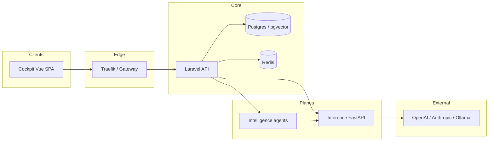

# SpiderNet OS

Multi-tenant **AI-native operating system**: event-sourced core, Laravel API, Vue cockpit, Python intelligence workers, and a dedicated inference plane.

## Architecture (high level)



## Where to read next

| Document | Contents |
| --- | --- |
| [`docs/ROADMAP.md`](docs/ROADMAP.md) | Phases 0–5 thesis, milestones, Phase 1–3 success checklist with code pointers |
| [`docs/internal/inference-plan.md`](docs/internal/inference-plan.md) | Canonical inference topology + routing source |
| [`docs/security/threat-model.md`](docs/security/threat-model.md) | STRIDE scope incl. inference plane |
| [`docs/feature-packs/SPEC.md`](docs/feature-packs/SPEC.md) | Vertical pack manifest semantics |
| [`docs/internal/scripts-inventory.md`](docs/internal/scripts-inventory.md) | What the extra repo-root automation is for |
| [`docs/internal/engineering-rules.md`](docs/internal/engineering-rules.md) | How work is reasoned about, verified and reported — evidence layers, failure grouping, sabotaging the guard, denominators, verification dimensions |

### Local developer quick path

```bash
docker compose up --build -d      # Tier-1 compose stack (see Makefile for slices)
```

Backend Artisan (from `backend/`): `php artisan spidernet:commands:verify`  
Feature packs: `php artisan spidernet:pack-validate` · `php artisan spidernet:pack-install real-estate-crm`

### Contributing & repo layout mental model

- **Product code** concentrates in `backend/`, `cockpit/`, `intelligence/`, `inference/`, `packages/`.
- Many **standalone scripts** (`mechanic-*`, `fix-*`, tunnel helpers, Hermes experiments) remain for operator velocity — see **[`docs/internal/scripts-inventory.md`](docs/internal/scripts-inventory.md)**.

### CI coverage (pull requests)

- Laravel **Pint** + **PHPUnit `CiFast` suite** (pure STE unit tests — no pgvector SQLite gap, no Redis dependency).
- **Cockpit** `npm ci` + **build** (+ lint when a `lint` npm script exists).
- **Ruff** on `intelligence/` + `inference/`.
- **Feature pack manifest** validator via `scripts/validate_feature_pack.py`.

Run full `php artisan test` locally requires **PostgreSQL with pgvector** and **Redis** for several Feature/unit tests — see [`backend/phpunit.xml`](backend/phpunit.xml) profiles.

---

## Atlas training-data loop

- Convert Cursor markdown chats:  
  `python scripts/convert_cursor_markdown_to_jsonl.py --input "<export.md>" --out-dir training_data --min-quality 2 --min-quality-sft 2 --quality-report`
- Evaluate:  
  `python scripts/eval_training_data_quality.py --sft training_data/sft.jsonl --preference training_data/preference.jsonl`
- One command (POSIX): `make training-gate TRAINING_INPUT="<export.md>"`
- PowerShell (+ auto-copy to Atlas):  
  `powershell -ExecutionPolicy Bypass -File scripts/training-gate.ps1 -InputPath "<export.md>"`  
  or `npm run training:gate:atlas -- -InputPath "<export.md>"`
- CI: `.github/workflows/training-data-quality-gate.yml`

### Atlas auto-apply

`scripts/training-gate.ps1` copies gated outputs into `intelligence/atlas/training/current` unless `-NoAutoApply` is set.

### Nightly Atlas refresh

`.github/workflows/atlas-training-refresh-nightly.yml` rebuilds gated JSONL into `intelligence/atlas/training/current` when `training_data/transcripts/**/*.md` changes or on schedule.
